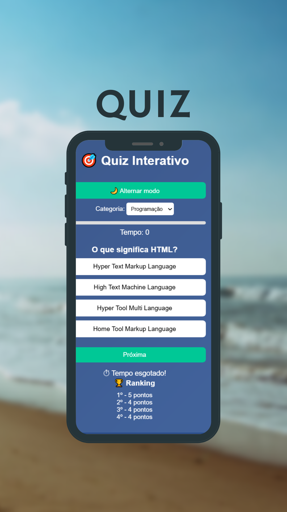

# 🎯 Quiz Interativo

Aplicação web de **Quiz Interativo** desenvolvida com **HTML, CSS e JavaScript**, permitindo que usuários testem seus conhecimentos em diferentes categorias com sistema de pontuação, timer e ranking.

Este projeto foi criado para praticar **lógica de programação, manipulação do DOM e interação com o usuário**.

---

# 🚀 Demonstração

💡 O usuário pode:

- Escolher uma categoria
- Responder perguntas
- Ver a resposta correta
- Acompanhar o tempo
- Ver sua pontuação
- Salvar pontuação no ranking

---

# 📸 Preview do Projeto

---

# ✨ Funcionalidades

🎯 Sistema de perguntas e respostas  
⏱ Timer para cada pergunta  
📊 Barra de progresso  
❌ Indicação de resposta correta ou errada  
🏆 Ranking salvo no navegador  
🌙 Modo escuro  
🔁 Reiniciar quiz  
📚 Múltiplas categorias  

---

# 🧠 Categorias do Quiz

## 💻 Programação

- HTML
- CSS
- JavaScript
- Métodos de Arrays

## 📜 História

- Descobrimento do Brasil
- Segunda Guerra Mundial
- História do Brasil

## 🔬 Ciência

- Sistema Solar
- Planetas
- Conhecimentos científicos

---

# 🛠 Tecnologias utilizadas

Este projeto foi desenvolvido com:

- HTML5
- CSS3
- JavaScript
- DOM Manipulation
- LocalStorage

---

# 📂 Estrutura do Projeto

quiz-interativo
│
├── index.html
├── style.css
├── script.js
└── preview.png

---

# ▶️ Como executar o projeto

1️⃣ Clone o repositório

git clone https://github.com/seuusuario/quiz-interativo.git

2️⃣ Abra a pasta do projeto

3️⃣ Execute o arquivo

---

# 📚 Aprendizados

Durante o desenvolvimento deste projeto foram praticados:

- Manipulação do **DOM**
- Lógica de programação
- Eventos em JavaScript
- Estrutura de dados com **arrays e objetos**
- Uso do **LocalStorage**
- Criação de interfaces interativas

---

# 👨‍💻 Autor

Desenvolvido por **Marcus Vinícius**

💼 Em busca de oportunidade como **Desenvolvedor Front-End Júnior**

🔗 GitHub  
https://github.com/seuusuario

---

⭐ Se você gostou do projeto, deixe uma **estrela no repositório**
